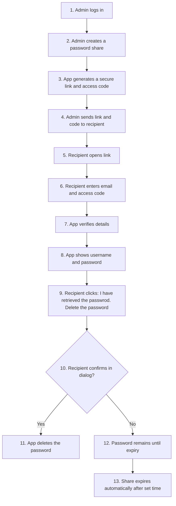

# sharepasswordAzure

[](https://github.com/mictsi/sharepasswordAzure/actions/workflows/build.yml)

Secure password sharing app built with ASP.NET Core (.NET 10).

Latest release: `0.2.0` (2026-02-23).

## Repository layout

- `sharepasswordAzure/` — web application project
- `sharepasswordAzure.Tests/` — test project
- `.github/workflows/build.yml` — CI workflow
- `CHANGELOG.md` — changelog
- `RELEASE_NOTES.md` — consolidated release notes

## Quick start

```bash
dotnet restore ./sharepasswordAzure.sln
dotnet run --project ./sharepasswordAzure/sharepasswordAzure.csproj
```

For full configuration and usage instructions, see:

- [sharepasswordAzure/README.md](sharepasswordAzure/README.md)
- [sharepasswordAzure/CONFIGURATION.md](sharepasswordAzure/CONFIGURATION.md)

## Azure provisioning script

A helper script is available at `scripts/provision-azure.ps1` to create required Azure resources for this app:

- Resource group
- Storage account + audit table
- Table Service SAS URL with permissions `rwdlacu`
- Key Vault for application secret storage
- Key Vault secret permissions for the app principal (existing principal or newly created app registration)
- Direct output of app config values (including SAS URL unless `-NoSecretOutput` is used)

Example:

```powershell
./scripts/provision-azure.ps1 `
    -SubscriptionId "<subscription-id>" `
    -ResourceGroupName "rg-sharepassword-prod" `
    -Location "swedencentral" `
    -NamePrefix "sharepass"
```

The script prints JSON output with created resource names and app environment variable values.

## 0.2.0 highlights

- Optional per-share Entra ID-only access mode.
- Recipient enforcement for OIDC-protected links.
- Audit logs UI with paging/search (default 100 rows).
- Configurable console audit logging levels (`DEBUG`, `INFO`, `ERROR`).
- Provisioning script assigns `Key Vault Secrets Officer` for app secret write permissions.

## Flowdiagram


