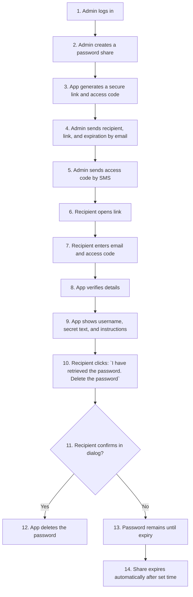

# sharepassword

[](https://github.com/mictsi/sharepassword/actions/workflows/build.yml)

Secure password sharing app built with ASP.NET Core (.NET 10).

Supported storage backends for both shares and audit logs:

- SQLite
- SQL Server
- PostgreSQL
- Azure Key Vault + Azure Table Storage

## Repository layout

- `sharepassword/` — web application project
- `sharepassword.Tests/` — test project
- `.github/workflows/build.yml` — CI workflow
- `CHANGELOG.md` — changelog
- `RELEASE_NOTES.md` — consolidated release notes

## Quick start

```bash
dotnet restore ./sharepassword.sln
dotnet run --project ./sharepassword/sharepassword.csproj
```

For full configuration and usage instructions, see:

- [sharepassword/README.md](sharepassword/README.md)
- [sharepassword/CONFIGURATION.md](sharepassword/CONFIGURATION.md)

## Admin password hash

Generate a PBKDF2-SHA256 admin password hash from the repository root with:

```powershell
./scripts/new-admin-password-hash.ps1
```

Paste the output into `AdminAuth:PasswordHash`. Cleartext `AdminAuth:Password` is no longer supported.

The full admin authentication configuration is documented in `sharepassword/README.md`.

## Azure provisioning script

A helper script is available at `scripts/provision-azure.ps1` to create required Azure resources for this app:

- Resource group
- Storage account + audit table
- Table Service SAS URL with permissions `rwdlacu`
- Key Vault for application secret storage
- Key Vault secret permissions for the app principal (existing principal or newly created app registration)
- Direct output of app config values (including SAS URL unless `-NoSecretOutput` is used)

Example:

```powershell
./scripts/provision-azure.ps1 `
    -SubscriptionId "<subscription-id>" `
    -ResourceGroupName "rg-sharepassword-prod" `
    -Location "swedencentral" `
    -NamePrefix "sharepass"
```

The script prints JSON output with created resource names and app environment variable values.

## Azure App Service deployment script

A helper script is available at `scripts/deploy-appservice.ps1` to:

- Create/update resource group
- Create/update Linux App Service plan and Web App
- Configure required app settings (environment variables)
- Publish and deploy the app package

By default, the script reads application settings from `sharepassword/appsettings.Development.json` (for example storage backend selection, per-backend config sections, admin credentials, OIDC, encryption, and share settings). CLI parameters still override file values when provided.

Example:

```powershell
./scripts/deploy-appservice.ps1 `
    -SubscriptionId "<subscription-id>" `
    -ResourceGroupName "rg-sharepassword-prod" `
    -Location "swedencentral" `
    -AppServicePlanName "asp-sharepassword-prod" `
    -WebAppName "app-sharepassword-prod"
```

The script prints the deployed app URL and Azure Portal URL on success.

## 0.2.6 highlights

- Added `Instructions` field for password shares with multiline formatting support and `1000` character limit.
- Updated share retrieval view to show both `Secret text` and `Instructions` preserving formatting.
- Added sharing guidance on the "Password Share Created" page for sending the recipient, link, and expiration time by email and the access code by SMS.
- Hardened user input validation for token, access code, recipient email, and username lengths/formats.

## Flowdiagram


```mermaid
flowchart TD
    S1["1. Admin logs in"] --> S2["2. Admin creates a password share"]
    S2 --> S3["3. App generates a secure link and access code"]
    S3 --> S4["4. Admin sends recipient, link, and expiration by email"]
    S4 --> S4A["5. Admin sends access code by SMS"]
    S4A --> S5["6. Recipient opens link"]
    S5 --> S6["7. Recipient enters email and access code"]
    S6 --> S7["8. App verifies details"]
    S7 --> S8["9. App shows username, secret text, and instructions"]
    S8 --> S9["10. Recipient clicks: `"I have retrieved the password. Delete the password`""]
    S9 --> S10{"11. Recipient confirms in dialog?"}
    S10 -->|Yes| S11["12. App deletes the password"]
    S10 -->|No| S12["13. Password remains until expiry"]
    S12 --> S13["14. Share expires automatically after set time"]
```
