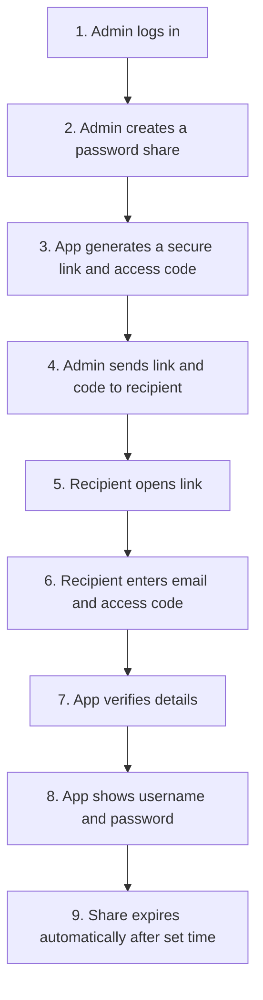

## Simple user flow

```mermaid
flowchart TD
    S1["1. Admin logs in"] --> S2["2. Admin creates a password share"]
    S2 --> S3["3. App generates a secure link and access code"]
    S3 --> S4["4. Admin sends link and code to recipient"]
    S4 --> S5["5. Recipient opens link"]
    S5 --> S6["6. Recipient enters email and access code"]
    S6 --> S7["7. App verifies details"]
    S7 --> S8["8. App shows username and password"]
    S8 --> S9["9. Share expires automatically after set time"]
```