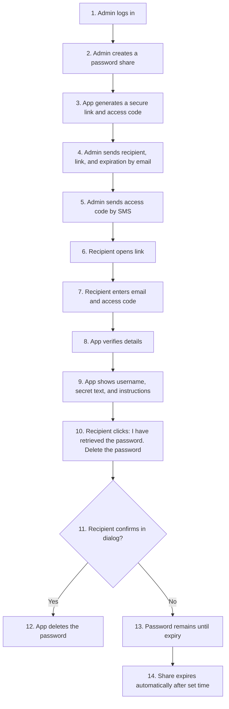

## Simple user flow

```mermaid
flowchart TD
    S1["1. Admin logs in"] --> S2["2. Admin creates a password share"]
    S2 --> S3["3. App generates a secure link and access code"]
    S3 --> S4["4. Admin sends recipient, link, and expiration by email"]
    S4 --> S4A["5. Admin sends access code by SMS"]
    S4A --> S5["6. Recipient opens link"]
    S5 --> S6["7. Recipient enters email and access code"]
    S6 --> S7["8. App verifies details"]
    S7 --> S8["9. App shows username, secret text, and instructions"]
    S8 --> S9["10. Recipient clicks: I have retrieved the password. Delete the password"]
    S9 --> S10{"11. Recipient confirms in dialog?"}
    S10 -->|Yes| S11["12. App deletes the password"]
    S10 -->|No| S12["13. Password remains until expiry"]
    S12 --> S13["14. Share expires automatically after set time"]
```